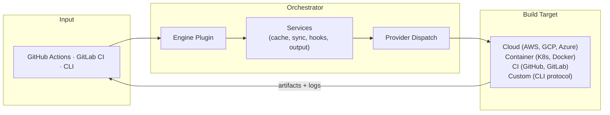
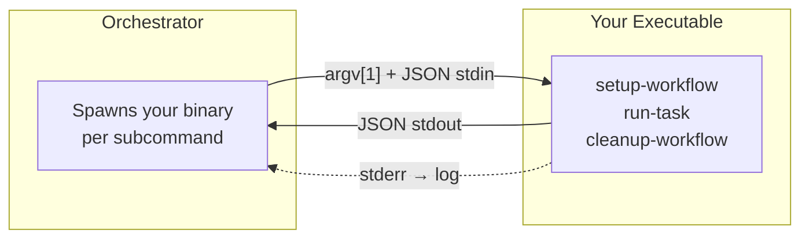

# @game-ci/orchestrator

Build orchestration engine for [Game CI](https://game.ci). Dispatches game engine builds to any infrastructure (cloud, self-hosted, or local), manages their lifecycle, and streams results back to your CI pipeline or terminal.



## Features

- **Engine agnostic**: Unity built-in, with a [plugin system](#engine-plugins) for Godot, Unreal, and custom engines
- **Multi-provider**: AWS Fargate, Kubernetes, GCP Cloud Run, Azure ACI, GitHub Actions, GitLab CI, Ansible, Remote PowerShell, local Docker, local system
- **Custom providers**: write your own in any language via the [CLI provider protocol](#custom-providers-via-cli-protocol)
- **CLI + CI**: `game-ci build` from your terminal, or as a step in GitHub Actions / GitLab CI workflows
- **Container hooks**: composable pre/post-build scripts with phase, provider, and platform filters
- **Caching**: engine-aware asset caching, retained workspaces, incremental file sync
- **Hot runner**: keep build environments warm for sub-minute iteration
- **Reliability**: automatic retries, health checks, provider fallback, failure recovery
- **Outputs**: artifact management, structured test results, real-time log streaming, Git LFS support

## Install

### Linux / macOS

```bash
curl -fsSL https://raw.githubusercontent.com/game-ci/orchestrator/main/install.sh | sh
```

### Windows PowerShell

```powershell
irm https://raw.githubusercontent.com/game-ci/orchestrator/main/install.ps1 | iex
```

### Options

| Variable | Description |
| --- | --- |
| `GAME_CI_VERSION` | Pin a specific release (e.g. `v2.0.0`). Defaults to latest. |
| `GAME_CI_INSTALL` | Override install directory. Defaults to `~/.game-ci/bin`. |

Pre-built binaries are also available on the [Releases](https://github.com/game-ci/orchestrator/releases) page.

## Quick Start

### GitHub Actions

```yaml
- uses: game-ci/unity-builder@v4
  with:
    providerStrategy: aws          # or k8s, local-docker, etc.
    targetPlatform: StandaloneLinux64
    gitPrivateToken: ${{ secrets.GITHUB_TOKEN }}
```

### CLI

```bash
# Build remotely
game-ci build \
  --providerStrategy aws \
  --projectPath ./my-unity-project \
  --targetPlatform StandaloneLinux64

# Check build status
game-ci status --providerStrategy aws
```

## Engine Plugins

No game engine logic is hardcoded into the core. Engine-specific behavior is provided through plugins. Unity ships as the built-in default; other engines plug in through the same minimal interface:

```typescript
interface EnginePlugin {
  name: string;           // 'unity', 'godot', 'unreal', etc.
  cacheFolders: string[]; // folders to cache between builds
  preStopCommand?: string; // container shutdown command (e.g. license cleanup)
}
```

The orchestrator's Docker-based workflow model generalizes to any engine: builds run in isolated containers with deterministic environments, engine-aware caching, incremental sync, and composable hooks. Adding a new engine doesn't require changing the orchestrator.

```bash
# Unity (default, no config needed)
game-ci build --targetPlatform StandaloneLinux64

# Other engines
game-ci build --engine godot --engine-plugin @game-ci/godot-engine
```

Plugins can be loaded from NPM packages, CLI executables (any language), or Docker images. See the [Engine Plugins guide](docs/engine-plugins.md) for details on writing your own.

## Providers

| Provider | Strategy flag | Description |
| --- | --- | --- |
| AWS ECS Fargate | `aws` | Serverless containers on AWS. Auto-provisions CloudFormation, S3, Kinesis. |
| Kubernetes | `k8s` | Builds as K8s Jobs with persistent volumes. Works with any cluster. |
| GCP Cloud Run | `gcp-cloud-run` | Serverless containers on Google Cloud. |
| Azure ACI | `azure-aci` | Azure Container Instances. |
| Local Docker | `local-docker` | Docker on the current machine. No cloud account needed. |
| Local System | `local-system` | Run directly on the host. No Docker or cloud needed. |
| GitHub Actions | `github-actions` | Dispatch builds to GitHub Actions workflows. |
| GitLab CI | `gitlab-ci` | Trigger builds on GitLab CI pipelines. |
| Ansible | `ansible` | Orchestrate builds via Ansible playbooks. |
| Remote PowerShell | `remote-powershell` | Run builds on remote Windows machines. |

All providers implement the same `ProviderInterface`, so every provider gets caching, hooks, middleware, and artifact management automatically.

### Custom Providers via CLI Protocol

Write providers in any language. The orchestrator communicates with your executable via JSON over stdin/stdout:



```bash
game-ci build \
  --providerExecutable ./my-provider \
  --projectPath ./my-unity-project \
  --targetPlatform StandaloneLinux64
```

See the [CLI Provider Protocol docs](docs/cli-provider-protocol.md) for the full specification.

## Development

```bash
yarn install          # Install dependencies
yarn test             # Run tests
yarn build            # Compile TypeScript
yarn game-ci --help   # Run CLI locally
yarn format           # Format with prettier
```

Requires Node.js >= 20 and Yarn 1.x.

## Documentation

- [Engine Plugins](docs/engine-plugins.md)
- [CLI Provider Protocol](docs/cli-provider-protocol.md)
- [Services](docs/services.md)
- [Provider Loader & Dynamic Loading](src/model/orchestrator/providers/README.md)

## Related

- [game-ci/unity-builder](https://github.com/game-ci/unity-builder) — GitHub Action that uses this package as an optional dependency
- [game-ci/documentation](https://github.com/game-ci/documentation) — Docusaurus docs site

## License

MIT
