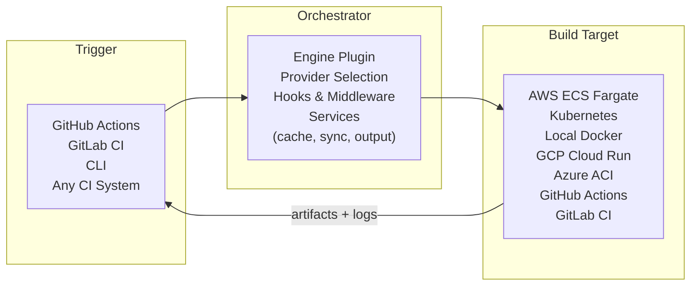
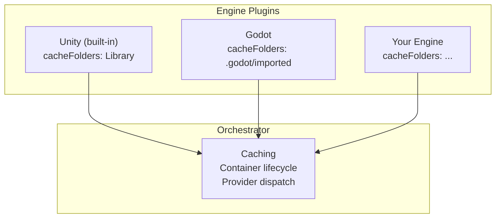
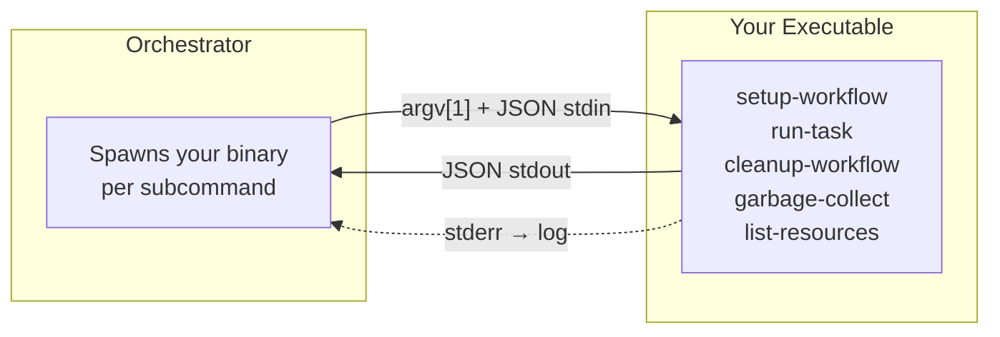
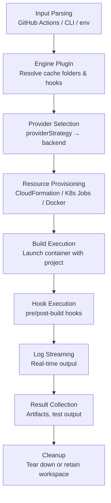

# @game-ci/orchestrator

Build orchestration engine for [Game CI](https://game.ci). Dispatches game engine builds to cloud infrastructure (AWS, Kubernetes, GCP, Azure), manages their lifecycle, and streams results back to your CI pipeline or terminal.

Engine agnostic — Unity is built-in, with a plugin system for Godot, Unreal, and custom engines.



## Features

- **Engine agnostic** — Unity built-in, with a [plugin system](#engine-plugins) for Godot, Unreal, and custom engines
- **Multi-provider** — AWS Fargate, Kubernetes, GCP Cloud Run, Azure ACI, GitHub Actions dispatch, GitLab CI, Ansible, Remote PowerShell, local Docker
- **Custom providers** — write your own provider in any language via the [CLI provider protocol](#custom-providers-via-cli-protocol)
- **CLI** — `game-ci build`, `game-ci orchestrate`, `game-ci status` from your terminal
- **GitHub Actions integration** — use as a step in any workflow via [game-ci/unity-builder](https://github.com/game-ci/unity-builder)
- **Container hooks** — composable pre/post-build scripts (S3 upload, Steam deploy, rclone sync)
- **Middleware pipeline** — trigger-aware composable hooks for advanced build customization
- **Caching** — engine-aware asset caching, retained workspaces, local cache layer
- **Incremental sync** — transfer only changed files to build containers
- **Hot runner** — keep build environments warm for sub-minute iteration
- **Build reliability** — automatic retries, health checks, failure recovery
- **Test workflows** — structured test execution with result parsing and reporting
- **LFS support** — efficient Git LFS handling for large assets
- **Artifact management** — collect, upload, and distribute build outputs
- **Log streaming** — real-time build logs via Kinesis (AWS) or pod logs (K8s)

## Install

### Quick Install (Linux / macOS)

```bash
curl -fsSL https://raw.githubusercontent.com/game-ci/orchestrator/main/install.sh | sh
```

### Quick Install (Windows PowerShell)

```powershell
irm https://raw.githubusercontent.com/game-ci/orchestrator/main/install.ps1 | iex
```

### Options

| Environment variable | Description |
| --- | --- |
| `GAME_CI_VERSION` | Pin a specific release (e.g. `v2.0.0`). Defaults to latest. |
| `GAME_CI_INSTALL` | Override install directory. Defaults to `~/.game-ci/bin`. |

```bash
# Example: install a specific version
GAME_CI_VERSION=v2.0.0 curl -fsSL https://raw.githubusercontent.com/game-ci/orchestrator/main/install.sh | sh
```

### Manual Download

Pre-built binaries for every platform are published on the [GitHub Releases](https://github.com/game-ci/orchestrator/releases) page. Download the binary for your OS/arch, make it executable, and place it on your `PATH`.

## Quick Start

### GitHub Actions

Add to your workflow via [game-ci/unity-builder](https://github.com/game-ci/unity-builder):

```yaml
- uses: game-ci/unity-builder@v4
  with:
    providerStrategy: aws          # or k8s, local-docker, etc.
    targetPlatform: StandaloneLinux64
    gitPrivateToken: ${{ secrets.GITHUB_TOKEN }}
    containerCpu: 2048
    containerMemory: 8192
```

### CLI

```bash
game-ci build \
  --providerStrategy aws \
  --projectPath ./my-unity-project \
  --targetPlatform StandaloneLinux64

game-ci status --providerStrategy aws

game-ci orchestrate \
  --providerStrategy k8s \
  --projectPath ./my-unity-project \
  --targetPlatform StandaloneLinux64
```

## Engine Plugins

The orchestrator is engine agnostic. Unity ships as a built-in plugin, and other engines plug in via the `EnginePlugin` interface — a minimal config that tells the orchestrator which folders to cache and what to run on container shutdown.



### EnginePlugin Interface

```typescript
interface EnginePlugin {
  name: string;            // 'unity', 'godot', 'unreal', etc.
  cacheFolders: string[];  // folders to cache between builds
  preStopCommand?: string; // shell command for container shutdown (optional)
}
```

### Using a Non-Unity Engine

```yaml
# GitHub Actions
- uses: game-ci/unity-builder@v4
  with:
    engine: godot
    enginePlugin: '@game-ci/godot-engine'
    targetPlatform: StandaloneLinux64
```

```bash
# CLI
game-ci build \
  --engine godot \
  --engine-plugin @game-ci/godot-engine \
  --target-platform linux
```

### Plugin Sources

Plugins can be loaded from three sources:

| Source | Format | Example |
| --- | --- | --- |
| NPM module | Package name or local path | `@game-ci/godot-engine`, `./my-plugin.js` |
| CLI executable | `cli:<path>` | `cli:/usr/local/bin/my-engine-plugin` |
| Docker image | `docker:<image>` | `docker:gameci/godot-engine-plugin` |

### Writing a Plugin

A complete engine plugin is typically 3-5 lines:

```typescript
// NPM package: index.ts
export default {
  name: 'godot',
  cacheFolders: ['.godot/imported', '.godot/shader_cache'],
};
```

For CLI executables, print JSON on stdout when called with `get-engine-config`. For Docker images, `docker run --rm <image> get-engine-config` must print JSON config.

See the [Engine Plugins documentation](https://game.ci/docs/github-orchestrator/advanced-topics/engine-plugins) for the full guide.

## Providers

| Provider | Strategy flag | Description |
| --- | --- | --- |
| AWS ECS Fargate | `aws` | Serverless containers on AWS. Auto-provisions CloudFormation stacks, S3, Kinesis log streaming. |
| Kubernetes | `k8s` | Schedules builds as K8s Jobs with persistent volumes. Works with any cluster. |
| GCP Cloud Run | `gcp-cloud-run` | Serverless containers on Google Cloud. |
| Azure ACI | `azure-aci` | Azure Container Instances. |
| Local Docker | `local-docker` | Run builds in Docker on the current machine. No cloud account needed. |
| GitHub Actions | `github-actions` | Dispatch builds to GitHub Actions workflows. |
| GitLab CI | `gitlab-ci` | Trigger builds on GitLab CI pipelines. |
| Ansible | `ansible` | Orchestrate builds via Ansible playbooks. |
| Remote PowerShell | `remote-powershell` | Run builds on remote Windows machines. |
| **Custom (CLI protocol)** | — | Write your own provider in any language. See below. |

### Custom Providers via CLI Protocol

Write providers in **any language** — Go, Python, Rust, shell, or anything that reads stdin and writes stdout. The orchestrator communicates with your executable via JSON over stdin/stdout:



Point `providerExecutable` at your binary:

```yaml
- uses: game-ci/unity-builder@v4
  with:
    providerExecutable: ./my-provider
    targetPlatform: StandaloneLinux64
```

Or from the CLI:

```bash
game-ci build \
  --providerExecutable ./my-provider \
  --projectPath ./my-unity-project \
  --targetPlatform StandaloneLinux64
```

Your executable receives a subcommand as `argv[1]` (`setup-workflow`, `run-task`, `cleanup-workflow`, etc.) and a JSON payload on stdin. Respond with JSON on stdout. Log to stderr.

See the [CLI Provider Protocol docs](https://game.ci/docs/github-orchestrator/providers/cli-provider-protocol) for the full specification and a working example.

## How It Works



## Project Structure

```
src/
├── cli/                    # CLI entry point and commands
│   └── commands/           #   build, orchestrate, status, activate, version, update
├── model/
│   ├── engine/             # Engine plugin system
│   │   ├── engine-plugin.ts    # EnginePlugin interface
│   │   ├── unity-plugin.ts     # Built-in Unity plugin
│   │   ├── module-engine-loader.ts  # Load plugins from NPM/local modules
│   │   ├── cli-engine-loader.ts     # Load plugins from CLI executables
│   │   └── docker-engine-loader.ts  # Load plugins from Docker images
│   ├── orchestrator/
│   │   ├── providers/      # Provider implementations
│   │   │   ├── aws/        #   ECS Fargate, CloudFormation, S3
│   │   │   ├── k8s/        #   Kubernetes Jobs, PVCs, RBAC
│   │   │   ├── docker/     #   Local Docker
│   │   │   ├── gcp-cloud-run/
│   │   │   ├── azure-aci/
│   │   │   ├── github-actions/
│   │   │   ├── gitlab-ci/
│   │   │   ├── ansible/
│   │   │   ├── remote-powershell/
│   │   │   └── cli/        #   CLI provider protocol
│   │   ├── services/       # Core services
│   │   │   ├── cache/      #   Engine-aware cache, child workspaces
│   │   │   ├── hooks/      #   Container hooks, command hooks, middleware
│   │   │   ├── hot-runner/ #   Hot runner protocol
│   │   │   ├── lfs/        #   Git LFS agent
│   │   │   ├── output/     #   Artifact management, upload handlers
│   │   │   ├── reliability/#   Build retry, health checks
│   │   │   ├── sync/       #   Incremental file sync
│   │   │   ├── test-workflow/ # Test execution and reporting
│   │   │   └── core/       #   Logging, resource tracking, workspace locking
│   │   └── workflows/      # Workflow composition
│   ├── cli/                # CLI adapter layer
│   └── input-readers/      # Input parsing (GitHub Actions, CLI, env)
└── test-utils/             # Shared test helpers
```

## Development

```bash
yarn install          # Install dependencies
yarn test             # Run tests
yarn build            # Compile TypeScript
yarn game-ci --help   # Run CLI locally
yarn format           # Format with prettier
```

Requires Node.js >= 20 and Yarn 1.x.

## Documentation

Full documentation at [game.ci/docs/github-orchestrator](https://game.ci/docs/github-orchestrator/introduction):

- [Getting Started](https://game.ci/docs/github-orchestrator/getting-started)
- [AWS Examples](https://game.ci/docs/github-orchestrator/examples/aws)
- [Kubernetes Examples](https://game.ci/docs/github-orchestrator/examples/kubernetes)
- [CLI Guide](https://game.ci/docs/github-orchestrator/cli/getting-started)
- [API Reference](https://game.ci/docs/github-orchestrator/api-reference)
- [Provider Setup Guides](https://game.ci/docs/github-orchestrator/providers/overview)
- [Engine Plugins](https://game.ci/docs/github-orchestrator/advanced-topics/engine-plugins)

## Related

- [game-ci/unity-builder](https://github.com/game-ci/unity-builder) — GitHub Action that uses this package as an optional dependency ([extraction PR #819](https://github.com/game-ci/unity-builder/pull/819))
- [game-ci/documentation](https://github.com/game-ci/documentation) — Docusaurus docs site ([docs update PR #541](https://github.com/game-ci/documentation/pull/541))

## License

MIT
