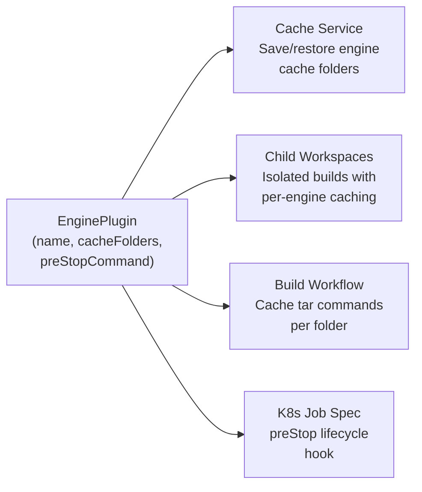
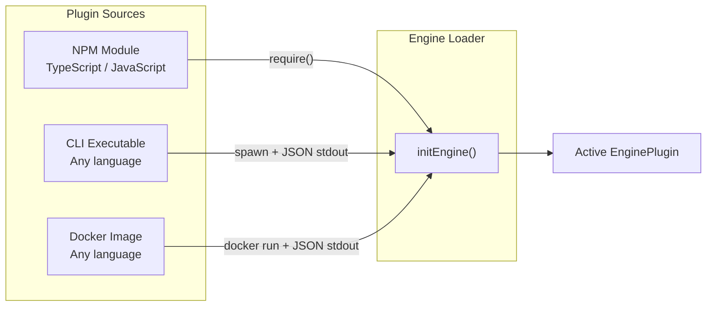
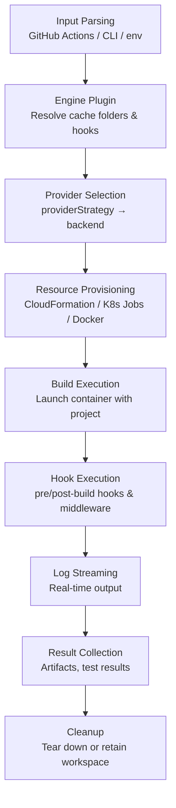

# Content removed from README

These sections were removed from README.md during the restructure (commit 380cc26).
They should be migrated to the documentation site (game-ci/documentation PR #541)
and this file can be deleted once that PR is merged.

---

## EnginePlugin Interface (detailed)

The interface is intentionally minimal, typically 3-5 lines:

```typescript
interface EnginePlugin {
  /** Engine identifier: 'unity', 'godot', 'unreal', etc. */
  name: string;

  /** Folders to cache between builds, relative to projectPath */
  cacheFolders: string[];

  /** Shell command for container shutdown — e.g. license cleanup (optional) */
  preStopCommand?: string;
}
```

| Field | Purpose | Example |
| --- | --- | --- |
| `name` | Identifies the engine throughout the orchestrator | `'godot'` |
| `cacheFolders` | Folders preserved between builds to speed up iteration | `['.godot/imported', '.godot/shader_cache']` |
| `preStopCommand` | Runs during container shutdown (e.g. Kubernetes preStop hook, 90s grace period) | `'cleanup-license.sh'` |

## How Plugins Integrate

Engine plugins feed into multiple orchestrator services:



- **Cache Service**: iterates `cacheFolders` to save/restore between builds
- **Child Workspaces**: creates isolated workspaces with engine-specific caches
- **Build Workflow**: generates cache initialization commands for each folder
- **Kubernetes preStop**: executes `preStopCommand` during pod shutdown (90s grace period)

## Built-in: Unity

Unity ships as the default plugin. No configuration needed:

```typescript
// Built into the orchestrator
const UnityPlugin: EnginePlugin = {
  name: 'unity',
  cacheFolders: ['Library'],
  preStopCommand: 'return_license.sh',
};
```

```bash
# Unity is the default — just build
game-ci build --targetPlatform StandaloneLinux64
```

## Using Other Engines

Specify `--engine` and `--engine-plugin` to use a non-Unity engine:

```yaml
# GitHub Actions
- uses: game-ci/unity-builder@v4
  with:
    engine: godot
    enginePlugin: '@game-ci/godot-engine'
    targetPlatform: StandaloneLinux64
```

```bash
# CLI
game-ci build \
  --engine godot \
  --engine-plugin @game-ci/godot-engine \
  --target-platform linux
```

## Plugin Sources

Plugins can be loaded from three sources, so you can write them in any language:



| Source | Format | Example |
| --- | --- | --- |
| NPM module | Package name or local path | `@game-ci/godot-engine`, `./my-plugin.js` |
| CLI executable | `cli:<path>` | `cli:/usr/local/bin/my-engine-plugin` |
| Docker image | `docker:<image>` | `docker:gameci/godot-engine-plugin` |

## Writing a Plugin

**NPM module** (TypeScript/JavaScript) — export an `EnginePlugin` object:

```typescript
// index.ts
export default {
  name: 'godot',
  cacheFolders: ['.godot/imported', '.godot/shader_cache'],
};
```

**CLI executable** (any language) — print JSON on stdout when called with `get-engine-config`:

```bash
#!/bin/bash
echo '{"name":"godot","cacheFolders":[".godot/imported",".godot/shader_cache"]}'
```

```python
#!/usr/bin/env python3
import json, sys
if sys.argv[1] == "get-engine-config":
    json.dump({"name": "godot", "cacheFolders": [".godot/imported"]}, sys.stdout)
```

**Docker image** — `docker run --rm <image> get-engine-config` must print JSON config:

```dockerfile
FROM alpine
COPY engine-config.sh /usr/local/bin/
ENTRYPOINT ["engine-config.sh"]
```

## How It Works



## Services

The orchestrator provides composable services that work with any engine and any provider:

| Service | Description |
| --- | --- |
| **Cache** | Engine-aware asset caching with local cache layer and retained workspaces |
| **Hooks** | Container hooks (pre/post-build), command hooks, and trigger-aware middleware pipeline |
| **Sync** | Incremental file sync — transfer only changed files to build containers |
| **Hot Runner** | Keep build environments warm between builds for sub-minute iteration |
| **Reliability** | Automatic retries, health checks, git integrity verification, provider fallback |
| **Output** | Artifact collection with pluggable upload handlers |
| **Test Workflow** | Structured test execution with result parsing and reporting |
| **LFS** | Git LFS tracking, hashing, and storage path mapping |
| **Core** | Logging, resource tracking, workspace locking, log streaming |

## Project Structure

```
src/
├── cli/                    # CLI entry point and commands
│   └── commands/           #   build, orchestrate, status, activate, version, update
├── model/
│   ├── engine/             # Engine plugin system
│   │   ├── engine-plugin.ts    # EnginePlugin interface
│   │   ├── unity-plugin.ts     # Built-in Unity plugin
│   │   ├── module-engine-loader.ts  # Load plugins from NPM/local modules
│   │   ├── cli-engine-loader.ts     # Load plugins from CLI executables
│   │   └── docker-engine-loader.ts  # Load plugins from Docker images
│   ├── orchestrator/
│   │   ├── providers/      # Provider implementations
│   │   │   ├── aws/        #   ECS Fargate, CloudFormation, S3
│   │   │   ├── k8s/        #   Kubernetes Jobs, PVCs, RBAC
│   │   │   ├── docker/     #   Local Docker
│   │   │   ├── local/      #   Local system (no Docker)
│   │   │   ├── gcp-cloud-run/
│   │   │   ├── azure-aci/
│   │   │   ├── github-actions/
│   │   │   ├── gitlab-ci/
│   │   │   ├── ansible/
│   │   │   ├── remote-powershell/
│   │   │   └── cli/        #   CLI provider protocol
│   │   ├── services/       # Core services
│   │   │   ├── cache/      #   Engine-aware cache, child workspaces
│   │   │   ├── hooks/      #   Container hooks, command hooks, middleware
│   │   │   ├── hot-runner/ #   Hot runner protocol
│   │   │   ├── lfs/        #   Git LFS agent
│   │   │   ├── output/     #   Artifact management, upload handlers
│   │   │   ├── reliability/#   Build retry, health checks
│   │   │   ├── sync/       #   Incremental file sync
│   │   │   ├── test-workflow/ # Test execution and reporting
│   │   │   └── core/       #   Logging, resource tracking, workspace locking
│   │   └── workflows/      # Workflow composition
│   ├── cli/                # CLI adapter layer
│   └── input-readers/      # Input parsing (GitHub Actions, CLI, env)
└── test-utils/             # Shared test helpers
```
