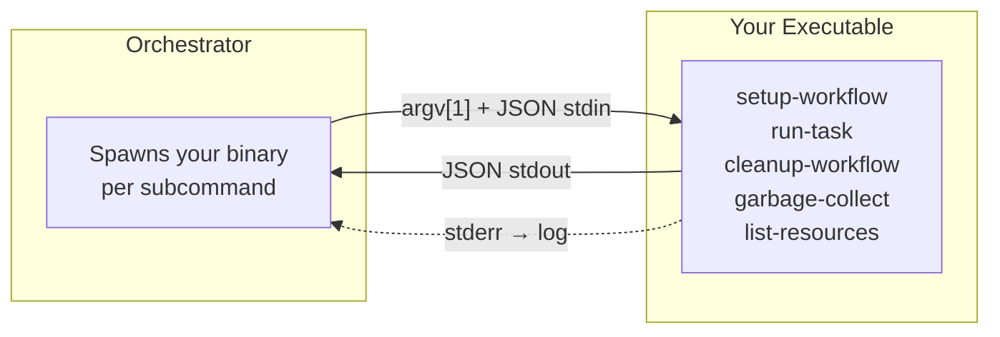

# CLI Provider Protocol

Write providers in any language — Go, Python, Rust, shell, or anything that reads stdin and writes stdout. The orchestrator communicates with your executable via JSON over stdin/stdout.



## Usage

Point `providerExecutable` at your binary:

```yaml
# GitHub Actions
- uses: game-ci/unity-builder@v4
  with:
    providerExecutable: ./my-provider
    targetPlatform: StandaloneLinux64
```

```bash
# CLI
game-ci build \
  --providerExecutable ./my-provider \
  --projectPath ./my-unity-project \
  --targetPlatform StandaloneLinux64
```

Your executable receives a subcommand as `argv[1]` (`setup-workflow`, `run-task`, `cleanup-workflow`, etc.) and a JSON payload on stdin. Respond with JSON on stdout. Log to stderr.

For the full provider interface specification and dynamic loading options (GitHub repos, NPM packages, local paths), see [providers/README.md](../src/model/orchestrator/providers/README.md).
