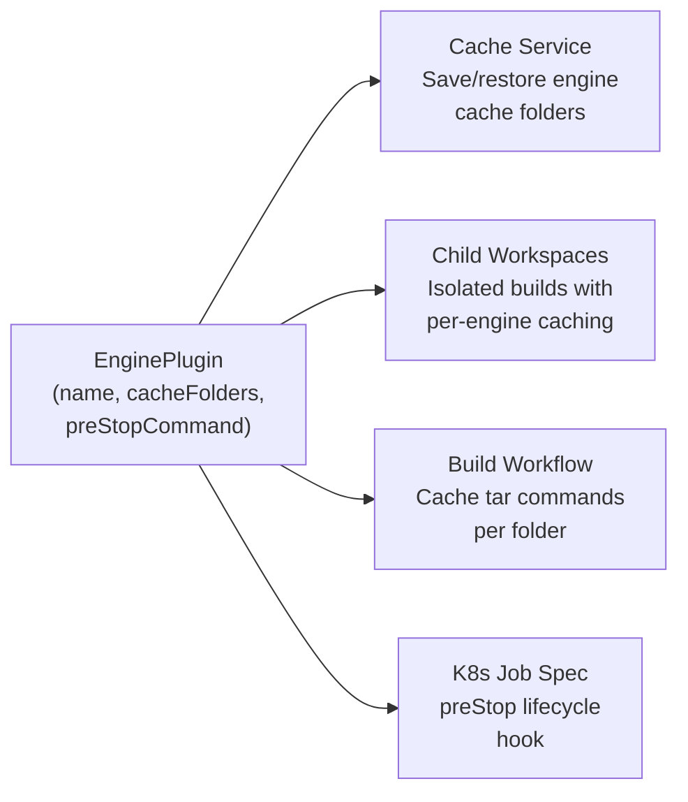
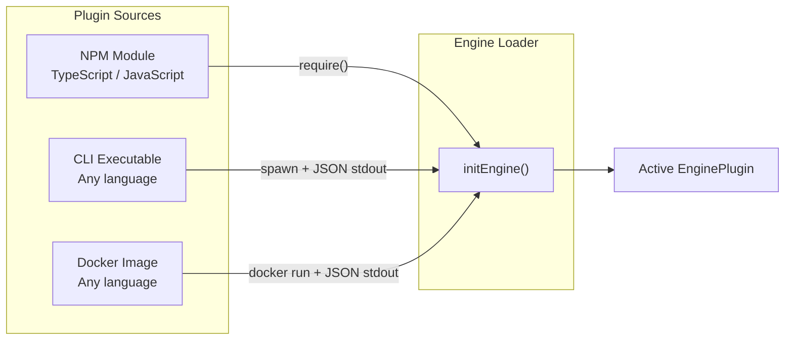

# Engine Plugins

The orchestrator delegates all engine-specific behavior to plugins. Unity ships as the built-in default; other engines (Godot, Unreal, custom) plug in through the same `EnginePlugin` interface.

## EnginePlugin Interface

The interface is intentionally minimal, typically 3-5 lines:

```typescript
interface EnginePlugin {
  /** Engine identifier: 'unity', 'godot', 'unreal', etc. */
  name: string;

  /** Folders to cache between builds, relative to projectPath */
  cacheFolders: string[];

  /** Shell command for container shutdown — e.g. license cleanup (optional) */
  preStopCommand?: string;
}
```

| Field            | Purpose                                                                         | Example                                      |
| ---------------- | ------------------------------------------------------------------------------- | -------------------------------------------- |
| `name`           | Identifies the engine throughout the orchestrator                               | `'godot'`                                    |
| `cacheFolders`   | Folders preserved between builds to speed up iteration                          | `['.godot/imported', '.godot/shader_cache']` |
| `preStopCommand` | Runs during container shutdown (e.g. Kubernetes preStop hook, 90s grace period) | `'cleanup-license.sh'`                       |

## How Plugins Integrate

Engine plugins feed into multiple orchestrator services:



- **Cache Service**: iterates `cacheFolders` to save/restore between builds
- **Child Workspaces**: creates isolated workspaces with engine-specific caches
- **Build Workflow**: generates cache initialization commands for each folder
- **Kubernetes preStop**: executes `preStopCommand` during pod shutdown (90s grace period)

## Built-in: Unity

Unity ships as the default plugin. No configuration needed:

```typescript
const UnityPlugin: EnginePlugin = {
  name: 'unity',
  cacheFolders: ['Library'],
  preStopCommand: 'return_license.sh',
};
```

```bash
# Unity is the default — just build
game-ci build --targetPlatform StandaloneLinux64
```

## Using Other Engines

Specify `--engine` and `--engine-plugin` to use a non-Unity engine:

```yaml
# GitHub Actions
- uses: game-ci/unity-builder@v4
  with:
    engine: godot
    enginePlugin: '@game-ci/godot-engine'
    targetPlatform: StandaloneLinux64
```

```bash
# CLI
game-ci build \
  --engine godot \
  --engine-plugin @game-ci/godot-engine \
  --target-platform linux
```

## Plugin Sources

Plugins can be loaded from three sources:



| Source         | Format                     | Example                                   |
| -------------- | -------------------------- | ----------------------------------------- |
| NPM module     | Package name or local path | `@game-ci/godot-engine`, `./my-plugin.js` |
| CLI executable | `cli:<path>`               | `cli:/usr/local/bin/my-engine-plugin`     |
| Docker image   | `docker:<image>`           | `docker:gameci/godot-engine-plugin`       |

## Writing a Plugin

**NPM module** (TypeScript/JavaScript) — export an `EnginePlugin` object:

```typescript
// index.ts
export default {
  name: 'godot',
  cacheFolders: ['.godot/imported', '.godot/shader_cache'],
};
```

**CLI executable** (any language) — print JSON on stdout when called with `get-engine-config`:

```bash
#!/bin/bash
echo '{"name":"godot","cacheFolders":[".godot/imported",".godot/shader_cache"]}'
```

```python
#!/usr/bin/env python3
import json, sys
if sys.argv[1] == "get-engine-config":
    json.dump({"name": "godot", "cacheFolders": [".godot/imported"]}, sys.stdout)
```

**Docker image** — `docker run --rm <image> get-engine-config` must print JSON config:

```dockerfile
FROM alpine
COPY engine-config.sh /usr/local/bin/
ENTRYPOINT ["engine-config.sh"]
```
