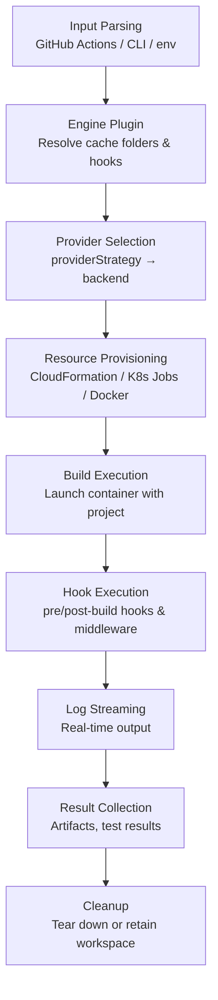

# Services

The orchestrator provides composable services that work with any engine and any provider.

## Overview



## Service Reference

| Service           | Description                                                                            |
| ----------------- | -------------------------------------------------------------------------------------- |
| **Cache**         | Engine-aware asset caching with local cache layer and retained workspaces              |
| **Hooks**         | Container hooks (pre/post-build), command hooks, and trigger-aware middleware pipeline |
| **Sync**          | Incremental file sync — transfer only changed files to build containers                |
| **Hot Runner**    | Keep build environments warm between builds for sub-minute iteration                   |
| **Reliability**   | Automatic retries, health checks, git integrity verification, provider fallback        |
| **Output**        | Artifact collection with pluggable upload handlers                                     |
| **Test Workflow** | Structured test execution with result parsing and reporting                            |
| **LFS**           | Git LFS tracking, hashing, and storage path mapping                                    |
| **Core**          | Logging, resource tracking, workspace locking, log streaming                           |

## Source Layout

```
src/model/orchestrator/services/
├── cache/         # Engine-aware cache, child workspaces
├── hooks/         # Container hooks, command hooks, middleware
├── hot-runner/    # Hot runner protocol
├── lfs/           # Git LFS agent
├── output/        # Artifact management, upload handlers
├── reliability/   # Build retry, health checks
├── sync/          # Incremental file sync
├── test-workflow/ # Test execution and reporting
└── core/          # Logging, resource tracking, workspace locking
```
